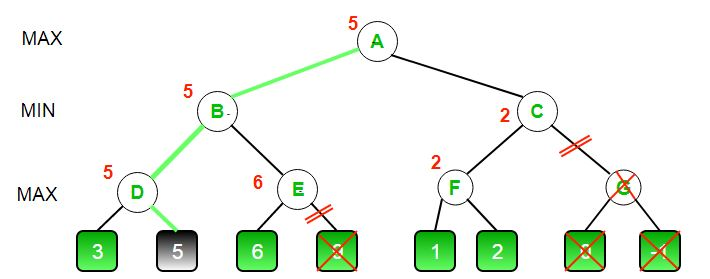
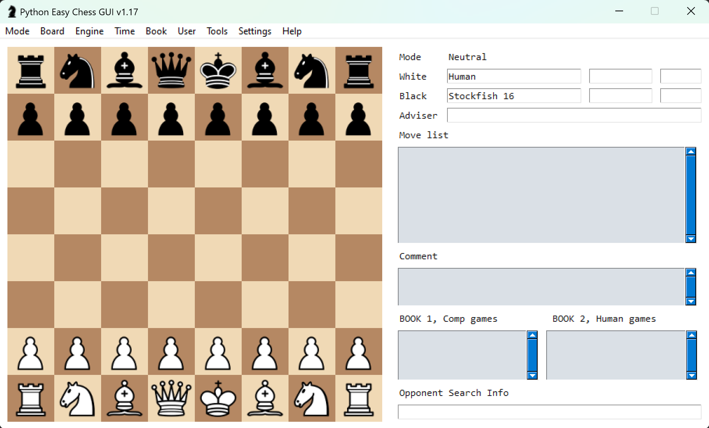

[](https://classroom.github.com/online_ide?assignment_repo_id=18276556&assignment_repo_type=AssignmentRepo)
<script type="text/javascript" async 
src="https://cdnjs.cloudflare.com/ajax/libs/mathjax/2.7.7/MathJax.js?config=TeX-MML-AM_CHTML">
</script>

# Homework - Adversarial Search ♔♕♗♘♙♖

Topics: Minimax and AlphaBeta

For this assignment you will be making your own chessbot taking advantage of the search techniques discussed in class. You do not need to program the rules of chess in order to complete this assignment.

---

# First Half - Programming Minimax & AlphaBeta


You must complete this section before moving on to the second half of the homework. You can use GenerativeAI to assist you. Perform the following steps.

1. Create the following search tree and visualize it using NetworkX (credit geeksforgeeks). It is recommended that you label the edges to make the choices clear (like `L` and `R`).


2. Add your [NetworkX](https://networkx.org/) rendering here (it does not need to look exactly like the above image):


3. Create a Minimax tree search function that will accept the tree you generated from Step 1 and compute the minimax value of the tree, updating the value of each node as it goes.

4. Render your new version of the search tree to show the choice ultimately decided upon at the root (i.e. color the left or right edge down to the leaf) after running the minimax algorithm.

5. Create an AlphaBeta tree search function that will accept the tree you generated from 1 and compute the minimax value of the tree using alpha-beta pruning, eliminating edges as it goes.

6. Render your new version of the search tree showing the pruned edges from alpha-beta pruning (i.e. if your algorithm decides not to search an edge color it something different). Add your rendering here:


If you need an example of what it can look like, see the below reference (without the nodes being labeled as A, B, ...) again originally from geeksforgeeks.




---

# Second Half


## Part 0 - Pre-req

There are some libraries and other software that you will need.

### Needed Python Packages

* chess - [pypi.org/project/chess/](https://pypi.org/project/chess/) used for modeling boards, identifying legal moves, and faciliating communication. Install with the command `pip install chess`
* pyinstaller - [pyinstaller.org/](https://pyinstaller.org/) for converting your .py files into .exe executables. Install with the command `pip install pyinstaller`
* chester - [pypi.org/project/chester/](https://pypi.org/project/chester/) runs tournaments of chessbots installed with `pip install chester`

```bash
pip install chess pyinstaller chester
```

### Visualizing Games

You can use any visualizer you like to play against an engine. The one we'll recommend is Python Easy Chess GUI (see instructions below) which requires some additional setup.

* PySimpleGUI [github.com/PySimpleGUI/PySimpleGUI](https://github.com/PySimpleGUI/PySimpleGUI) creates a generic GUI. Install with `pip install pysimplegui`
* Pyperclip [github.com/asweigart/pyperclip](https://github.com/asweigart/pyperclip) allows for copy/paste functionality with the GUI. Install with `pip install pyperclip`
* Python Easy Chess GUI [https://github.com/fsmosca/Python-Easy-Chess-GUI](https://github.com/fsmosca/Python-Easy-Chess-GUI) clone this repository in a second directory and run the command `python python_easy_chess_gui.py` to run the program.

When setup correctly, it will look like:



```bash
pip install pysimplegui pyperclip
python python_easy_chess_gui.py
```

It is a good idea to turn off Book Moves (Book > Set Book > Uncheck "Use book") and to limit the depth of the chessbots (Engine > Set Depth > 12) so that some bots don't spend all their time thinking. To add a chessbot, go to Engine > Manage > Install > Add > then select your .exe executable. Simply select the opponent by going to Engine > Set Engine Opponent > and select your bot. When ready to play, click Mode > Play. Visit [https://lczero.org/play/quickstart/](https://lczero.org/play/quickstart/) for other visualizers.

### Engines and Tournaments

To create your executable agent use the command `pyinstaller --onefile random_chess_bot.py` except replace with your agent file. This will create an executable, like `random_chess_bot.exe`, inside of a new directory called `dist`. For simplicity, move this file to the directory with the tournament code. **If you are on Mac**, there is another way to make this program executable by using `chmod +x random_chess_bot.py` in the terminal, but pyinstaller should work as well.

In order to test your agent, you'll need to run it against at least one other strong chessbot executable. Good candidates include:

* Stockfish - recommended and probably the strongest open source chessbot [https://stockfishchess.org/](https://stockfishchess.org/) **if you are on mac** you can install using the command `brew install stockfish` and then you should be able to simply run the command `stockfish` to start the bot.
* Goldfish - [https://github.com/bsamseth/Goldfish](https://github.com/bsamseth/Goldfish)
* Leela Chess Zero (Lc0) - [https://lczero.org/](https://lczero.org/)

We recommend downloading the executable to the same directory as the chester tournament code. Edit the [tournament.py](tournament.py) file to add your chessbot as a player. You can then run a tournament with `python tournament.py` and wait for the results.

### How Chess Package Works

If you run the following Python code you'll see the output below it.

```python
import chess

board = chess.Board()
print(board)
```

```text
r n b q k b n r
p p p p p p p p
. . . . . . . .
. . . . . . . .
. . . . . . . .
. . . . . . . .
P P P P P P P P
R N B Q K B N R
```

This is an 8x8 chessboard with the capital letters representing White and lower case for Black. The letter 'P' is for Pawn, 'R' for Rook, 'N' for Knight (not 'K'), 'Q' for Queen, and 'K' for King. The columns are represented with the letters 'a', 'b', 'c', ..., 'h' and rows with the numbers 1 through 8. This means that to give the move Knight on b1 to the spot c3, it is given with the notation Nc3.

The library is able to determine what are the possible valid legal moves allowed by the game with the command `board.legal_moves` which at the start gives:

```text
<LegalMoveGenerator at 0x2283a4b3e80 (Nh3, Nf3, Nc3, Na3, h3, g3, f3, e3, d3, c3, b3, a3, h4, g4, f4, e4, d4, c4, b4, a4)>
```

You can find lots of documentation about all of the functions built into the Python chess library [https://python-chess.readthedocs.io/en/latest/core.html](https://python-chess.readthedocs.io/en/latest/core.html).

If during the development process you wish to visualize the board state like a more traditional image, take a look at `chess.svg` rendering [https://python-chess.readthedocs.io/en/latest/svg.html](https://python-chess.readthedocs.io/en/latest/svg.html). For example, the following code creates the resulting svg graphic.

```python
import chess
import chess.svg

b = chess.Board()
svg = chess.svg.board(b)
f = open("board.svg", "w")
f.write(svg)
f.close()
```


You can add images to NetworkX graphs if you like, see [networkx.org/documentation/](https://networkx.org/documentation/stable/auto_examples/drawing/plot_custom_node_icons.html) for more info.

## Part 1 - Instructions

This assignment is meant to ensure that you:

* Understand the concepts of adversarial search
* Can program an agent to traverse a graph along edges
* Experience developing different pruning algorithms
* Apply the basics of Game Theory
* Can argue for chosing one algorithm over another in different contexts

You are tasked with:

0. Copy [random_chess_bot.py](random_chess_bot.py) and update it to develop a new brand new and intelligent chessbot with a unique & non-boring name. ***Do not name it `my_chess_bot`, your name, or something similar.*** If you do, you will ***automatically earn a zero*** for this assignment. Come up with something creative, humourous, witty, adventuous, -- or something will strike fear into the hearts of the other chessbots in this competition.
1. Develop a strong evaluation function for a board state. Take a look at "Programming a Computer for Playing Chess" by Claude Shannon [https://www.computerhistory.org/chess/doc-431614f453dde/](https://www.computerhistory.org/chess/doc-431614f453dde/) published in 1950. You will specifically want to take a look at section 3 in which Shannon describes a straight-forward evaluation function that you can simplify to only evaluate material (pieces) to score a board state.

  * **Note** that your evaluation function will play a crutial role in the strength of your chessbot. It is ok to start with a simple function to get going, but you will need to find ways to improve it because your bot will be competing with the bots from the rest of the class and points are on the line.
  * Talk the teaching team for helpful tips if you are really stuck.
  
2. Alter your chessbot so that when called with the command line parameter `draw` (such as `python random_chess_bot.py draw`) it creates a Minimax visualization that:

* Starts with the root as the end of a named opening sequence such as the Queen's Gambit Declined 1. d4 d5 2. c4 e6 [https://en.wikipedia.org/wiki/Queen%27s_Gambit_Declined](https://en.wikipedia.org/wiki/Queen%27s_Gambit_Declined). This is because in order for a simple evaluation function to have any chance, there needs to be the potential for pieces to be captured. If you don't like the QGD, we can suggest the:
  * [Ruy Lopez - Morphy Defence](https://en.wikipedia.org/wiki/Ruy_Lopez) 1. e4 e5 2. Nf3 Nc6 3. Bb5 a6
  * [Four Nights Sicilian Defence](https://www.chess.com/openings/Sicilian-Defense-Four-Knights-Variation) 1.e4 c5 2.Nf3 e6 3.d4 cxd4 4.Nxd4 Nf6 5.Nc3 Nc6
  * [Vienna Game Frankenstein–Dracula Variation](https://en.wikipedia.org/wiki/Vienna_Game,_Frankenstein%E2%80%93Dracula_Variation) 1. e4 e5 2. Nc3 Nf6 3. Bc4 Nxe4
  * Any other opening you like that ends with Black making a move so that it is White's turn.
* Have your graph select the top three moves per node and label each edge with the move's notation.
* Limit the depth of the generated tree visuals to four (4) half-moves ahead (W-B-W-B). This is because the visuals will be too difficult to read otherwise.
* Label the leaf nodes with the result of that board state's evaluation
* Perform the Minimax algorithm on the tree, labeling each node backpropogating with the correct minimax value.
* Identify the final value of the game tree and the move that your bot will select in a title or subtitle.
* Perform Alpha-Beta pruning on this game tree to re-color edges and subtrees that have been pruned.
* Finally, draw on the image (use a tablet or print and mark on it) with the results of alpha and beta for each node -- clearly identifying the why & how your graph pruned these edges that it pruned.
* If no branches were pruned, change your opening and/or your evaluation function so that there is some demonstrable pruning.

3. At any given point in a chess game there are roughly 20 possible moves. Your Minimax and Alpha-Beta Pruning algorithms will spend a lot of time on what are clearly poor moves. You are allowed alter these algorithms slightly to not even consider poor quality moves or to only look at the top 7 to 10 moves at a time.
4. When you are done, answer the questions in the reflection and complete the last two sections.

### Documentation

Ensure that your chessbot follows normal PyDoc specs for documentation and readability.

## Part 2 - Reflection

Update the README to answer the following questions:

1. Describe your experiences implementing these algorithms. What things did you learn? What aspects were a challenge?
```
I learned how these algorithms build game trees, explore moves, and backpropagate scores. The challenge was managing branching and applying alpha-beta pruning correctly. The evaluation function proved crucial, helping make better decisions despite depth limits. Overall, alpha-beta with evaluation function made the search faster and more effective.
```
2. These algorithms assumed that you could reach the leaves of the tree and then reverse your way through it to "solve" the game. In our game (chess) that was not feasible. How effective do you feel that the depth limited search with an evaluation function was in selecting good moves? If you play chess, were you able to beat your bot? If so, why did you beat it? If not, what made the bot so strong - the function or the search?
```
Depth-limited search with an evaluation function worked pretty well for picking decent moves. Since I don’t play chess, my bot beat me every time, which shows that even with limited depth, a solid evaluation function and good search can outperform a beginner. In my case, the bot’s strength came from its ability to analyze positions systematically, not deep strategy.
```
3. Shannon wrote "... it is possible for the machine to play legal chess, merely making a randomly chosen legal move at each turn to move. The level of play with such a strategy is unbelievably bad. The writer played a few games against this random strategy and was able to checkmate generally in four or five moves (by fool's mate, etc.)" Did you try playing the provided random chessbot and if so, what this your experience? How did your chessbot do against the random bot in your tests?
```
It was pretty funny that my bot sometimes lost to the random one. After tweaking the evaluation function, it could always win as White, but as Black, it still struggled and sometimes lost. It really showed me how much the evaluation function matters and how small changes can make a huge difference.
```
4. Explain the what would happen against an opponent who tries to maximize their own utility instead of minimizing yours.
```
I don’t think maximizing my own score instead of minimizing my opponent’s would change much since chess is a zero-sum game. My evaluation function already works that way—it just evaluates the board based on piece values, adding points for my pieces and subtracting for the opponent’s. In the end, whether I maximize my own score or minimize theirs, the best move stays the same.
```
5. What is the "horizon" and how is it used in adversarial tree search?
```
The horizon is the depth limit of a search tree, beyond which the algorithm can’t see. This leads to the horizon effect, where the bot fails to anticipate key events just beyond its search range—like delaying an unavoidable loss or missing a winning move.

To handle this, I used iterative deepening to gradually extend depth, move ordering to improve efficiency, and depth-limited evaluation to keep searches practical. While deeper searches reduce the horizon effect, strong evaluation functions and Alpha-Beta pruning help make the best decisions within limited depth.
```
6. (Optional - Not Graded) What did you think of this homework? Challenging? Difficult? Fun? Worth-while? Useful? Etc.?
```
I think this also was a really interesting assignment. It was definitely challenging, and I don't think I could have completed it without GenAI. But with its explanations and hands-on coding, I got a much better understanding of how chess AI works. Compared to other more tedious assignments, this project feels more worthwhile—plus, having it on my GitHub could be a great advantage.
```

---

### Your Images Here

Add the images that you created from the forced opening that you chose so that it demonstrates AlphaBeta Pruning.


### Your Evaluation Function Here

Conciesly and effictively describe the evaluation function that you used for your chessbot. You can also use Latex as long as you explain the symbols and justify why you created your function in the manner with which you did.

$$f(X,n) = X_n + X_{n-1}$$
## Evaluation Function

Let **f(board)** be the overall evaluation from White’s perspective. Then:


$$
f(\text{board}) =
\underbrace{\text{Material}(\text{board})}_{\text{sum of piece values}}
+ \underbrace{0.1 \times 
\bigl( \text{Mobility}_W - \text{Mobility}_B \bigr)}_{\text{legal moves defference}}
+ \underbrace{\text{CenterControl}(\text{board})}_{\text{pawns/knights bonus}}
$$

Where:

### Material
We sum up the piece values for all squares:

$$
\text{Material}(\text{board}) =
\sum_{s \in \text{all squares}}
\begin{cases}
+v(\text{piece}), & \text{if piece is White},\\
-v(\text{piece}), & \text{if piece is Black},\\
0, & \text{if empty}.
\end{cases}
$$

with typical piece values:

$$
v(\text{pawn})=100, \quad
v(\text{knight})=320, \quad
v(\text{bishop})=330, \quad
v(\text{rook})=500, \quad
v(\text{queen})=900, \quad
v(\text{king})=0.
$$

### Mobility
We measure the number of legal moves for White minus the number of legal moves for Black:

$$
\text{Mobility}_W = \bigl|\text{legalMoves}_W\bigr|, \quad
\text{Mobility}_B = \bigl|\text{legalMoves}_B\bigr|.
$$

Then we weight that difference by \( 0.1 \).
